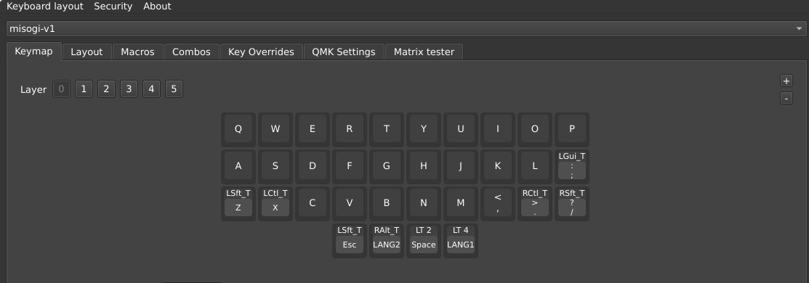
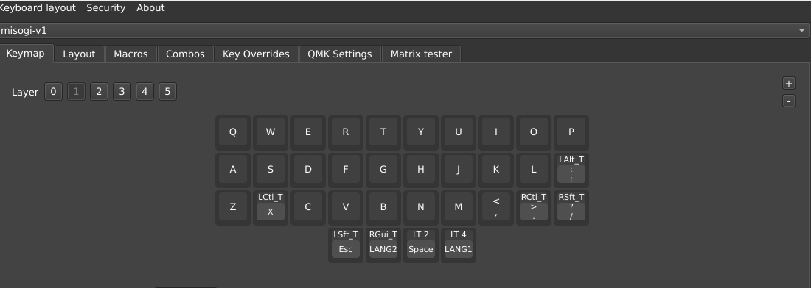
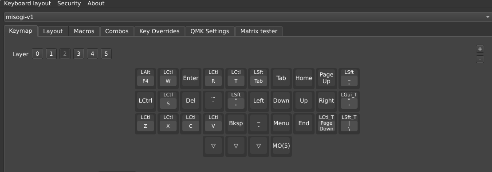
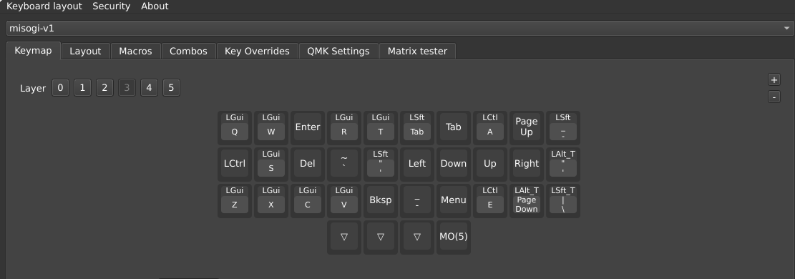
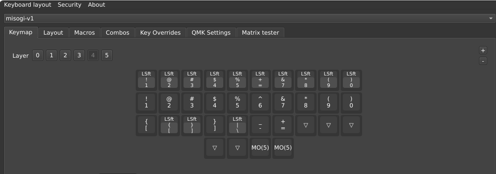
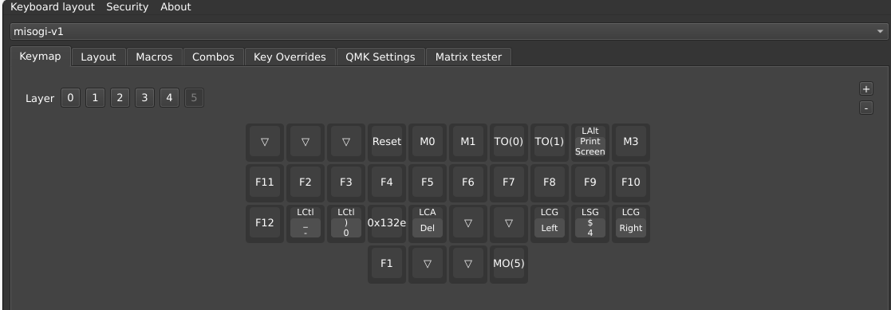

こちらが普段使っているキーマップになります。  
他に、コンボキーに「`K`+`L`」で `-` を割り当てています。

- 0: Windows 用
- 1: Mac 用
- 2: Windows 用、カーソルやコピーなど
- 3: Mac 用、カーソルやコピーなど
- 4: 数字・記号
- 5: ファンクションやスクショ、デスクトップ移動用など

仕事で win-mac をよく切り替えるので、なるべく同じ操作で同じ動きができるようにしています(完全には無理ですが)。  
スペースキーが Fn の役割をしています。  
これやるとゲームでスペースキー押しっぱなしにできないので別レイヤでなんとかしないとですね。ゲームはコレでやらないですが。

## 0:windows 用

両端、`Z` や `X` にも `Shift` や `Ctrl` の役を持たせています。  
少キーなら必須ですね！
mac の「日本語入力オン」「日本語入力オフ」が便利なので、windows でも使えるようにしました(今オンだっけ？とか考えなくて良い)。

`Win` キーもないと困るので、`;` にアサイン。

## 1:mac 用

基本は win と一緒。

## 2:Windows 用、カーソルやコピーなど

mac だと `Cmd + Q` でアプリ終了できたりするので `Alt + F4` が発火するように真似してます。  
あとはコピペが win & mac 同じ操作でできるように。  
カーソルは慣れ親しんだ `vi` 配列です。

`Enter` がこのレイヤ、この位置にあるのがポイント。マウス操作でコピペしながら`Enter`押していくシーンで大活躍です。

`~`、`'`、`"` は苦し紛れ・・・

## 3:Mac 用、カーソルやコピーなど

基本は win と一緒。  
`Home` や `End` が mac だと思ったように動いてくれないので `emacs` の動作を入れています。

## 4:数字・記号

数字を中段、`Shift` + 数字を上段に配置してます。

`^` のみ `Shift + 6` で、代わりに `+` になってます。  
当初は `+` の方が出番多いだろ、と思ってましたが正規表現で `^` もよく使うんですよね・・・

## 5:ファンクションやスクショ、デスクトップ移動用など

左手親指をスペースキーに出張、右手親指で数字レイヤを押すことで現れるレイヤー。  
めったに使わない `F1～F12` やデスクトップ移動、スクリーンショット呼び出しなどを割り当てています。

`BMP` の場合、`BT0` ~ `BT3` も入れて接続先を 4 台切り替えられるようにしています。

## 終わりに

QMK に公開されている少キーマップをチェックすると、常時１キーでアクセスできるファーストレイヤに `Enter` や `-` を入れている方が多い印象です。

好みや慣れでどうとでもなるところなので、少キー好きの参考になれば幸いです！
