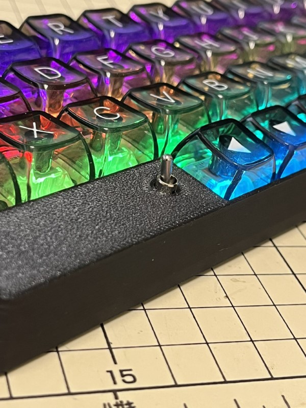

## v3 基盤到着！

`禊v3`の基盤が届きましたので、早速組み立てました！  


<!-- more -->

## 良かった点

### LED が光る

BMP の仕様で USB 接続時のみですが、ビッカビカに光ります。  
このために透明キーキャップ用意して待ってました。楽しい。

### 電源スイッチをトグル式に

写真のように、電源スイッチを天板にトグルスイッチが出るようにしてみました。  
すごく便利。薄型のプロファイルだと邪魔かも。

プッシュ式のも使える設計にしているので別機で試してみるつもりです。

## 悪かった点

### PCBA 不良

JLCPCB で PCBA 頼んでいた LED が 5 枚中 2 枚で点灯不良。

40%が使えない、となるとちょっとキツイ・・・  
LED 剥がしてくっつけるとなると跡も汚くなるし、交換できる気もしない。

軽くネットで検索してみても導通不良などは見当たらないのでなんかハズレ引いたかなぁという感じ。  
クリアランス問題で LED の穴小さくするよ、とのことだったのでなにか影響があったのかもしれない。  
次回の設計ではちゃんとクリアランス確認する。

## 3D プリンタが故障

本体は大丈夫かと思うんですが、ヒートブロックごと交換が必要です。  
しばらくノズル交換サボっていたせいだと思われます・・・

### 災い転じて？

悲しみに暮れていたところ、JLCPCB に頼むとかなり安い値段で製造してくれるご様子。  
早速製造データを入稿してお願いしました。  
なおレビュー指摘で３回ほどファイル入れ替えしました。  
何度も丁寧にレビューしてくれて助かります。

トップケース、スイッチレイヤ、ボトムカバーの一式を２セット。

```text
商品合計: $33.90
送料: $9.13
発注合計: $43.03
```

しかも１セットは塗装までお願いしてこの値段です。  
お値打ち過ぎて感動・・・！！

## 3D プリント発注するときの制限

JLCPCB に 3D プリント発注するとき、いくつか制限があったのでメモ。

- 厚さは最低 1.2mm
  - それ以下でも割れや変形を許容するならやってくれそう
- 素材によっては最低サイズ制限がある
  - ABS や PLA-CF でボトムカバーを出してもらおうとしたら、10x10x30mm 以上じゃないとだめ、ということでした
  - 中身スッカスカで壁厚 2mm でも全体サイズで超えていれば OK です
  - 他の素材でも制限あるかも
- 塗装するときは厚さ `+0.2mm` というポストをどこかで見た
