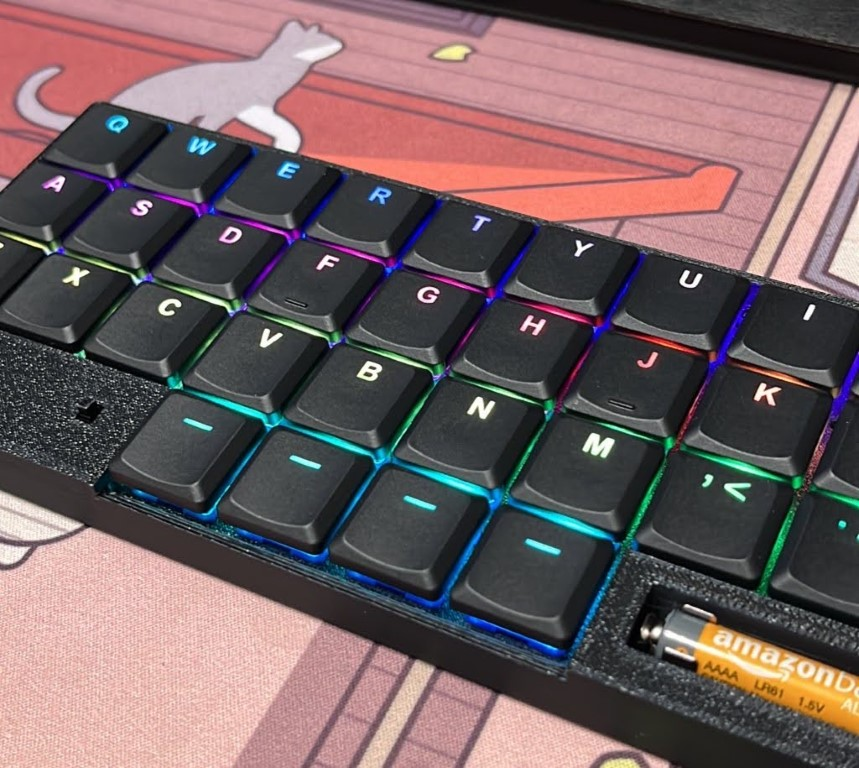

v3 に続き、新しい基盤が出来上がってきました！  
今回はこちらのプロトタイプ検証がメインです。  
`Low Profile` のスイッチを使ってみたかったので、ソケットタイプを変更しています。

<!-- more -->

## 今回の基盤設計

- `Low Profile` 対応
- LED の位置をスイッチの上(奥)側に
- `AAAA(単６)` を選択できるようにした
- 配線と基盤エッジのクリアランスを見直し

`THT(Tai-Hao Thins)`キーキャップを使いたかったので、レジェンドがきれいに光るように LED ポジションを奥側にしました。

## 組み立て

到着したので早速組み立て！

今回もダイオードと LED は`JLCPCB`さんにて、PCBA をお願いしました。  
点灯不良もなく、きれいに光っています！  
一応、５枚の基板すべてを確認し、点灯不良がないことが確認できました。

やっぱり前回の点灯不良は設計不良な基盤に問題があったようです。  
具体的には配線と LED エッジのクリアランスに問題があり、エッジ側を狭くしてしまったので LED が少し浮いた状態になっていました。

奥側にした LED ポジションもいい感じ。v3 組立時、手前にあるとちょっとまぶしかったというのもあります。  
スイッチは静音タイプの `Kailh Deep Sea Islet` です。

## プロトタイプチラ見せ

いつも単４電池を使っていましたが、LowProfile では悪目立ちするので `AAAA(単６)` を使える設計にしました。  
いいバランスでインストールできたと思います！ なお電池ホルダーの基板側設計は穴が大きすぎるので要改善。

## 命名？

１枚目の写真で見えちゃってますが、禊とはちょっとコンセプトがずれたので「薄い」＝「thin」から、「シン禊」としました。  
いろいろアレっぽいネーミングですね。

## 今後の動き

### シン禊

だいたいやりたいことができたので、基板を改善して頒布できるようにしたいと思います！

### 禊 v3

点灯不良があったので、設計見直してリベンジしようと思います。  
THT もいいですが、MX プロファイルの方が打鍵しやすいので仕事では v3 をメインで使いたいというのもあり。  
静音スイッチが思いのほか良かったので、ボックスタイプでも試してみたいと思います。
