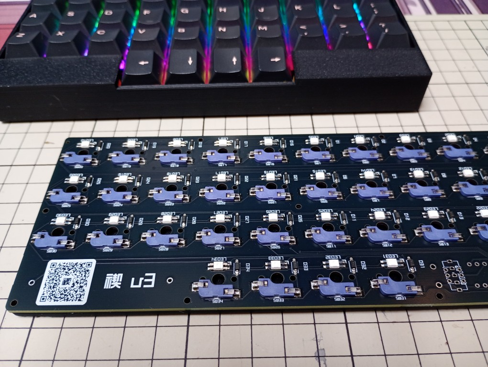
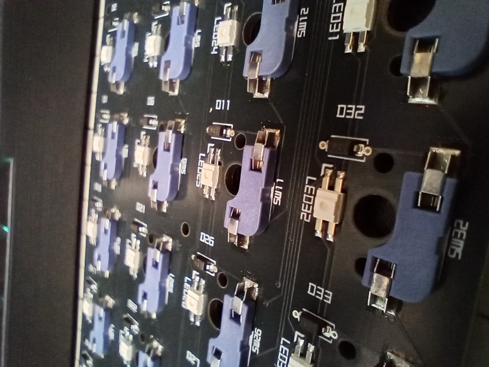
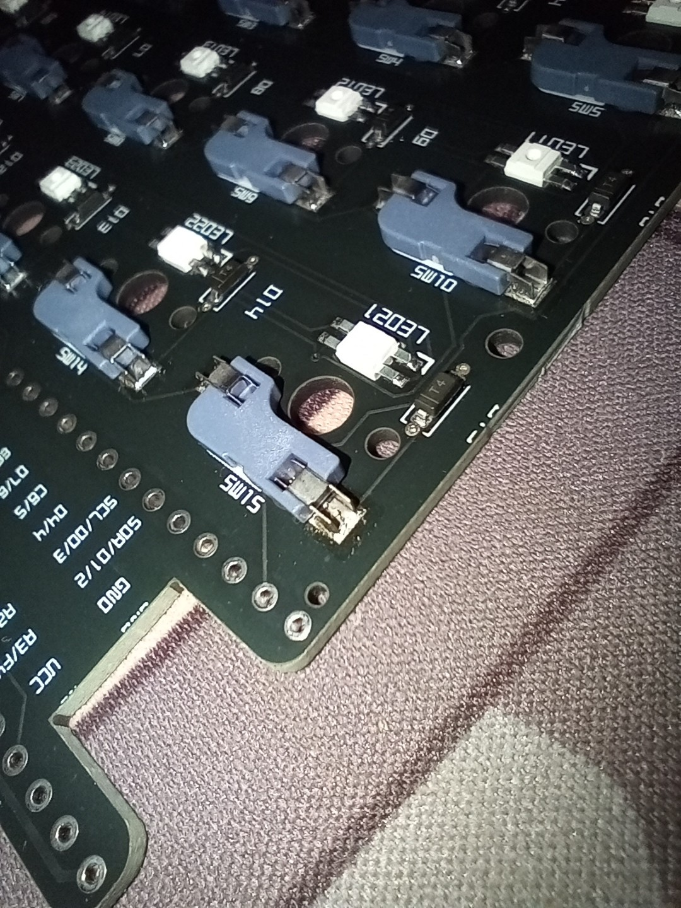
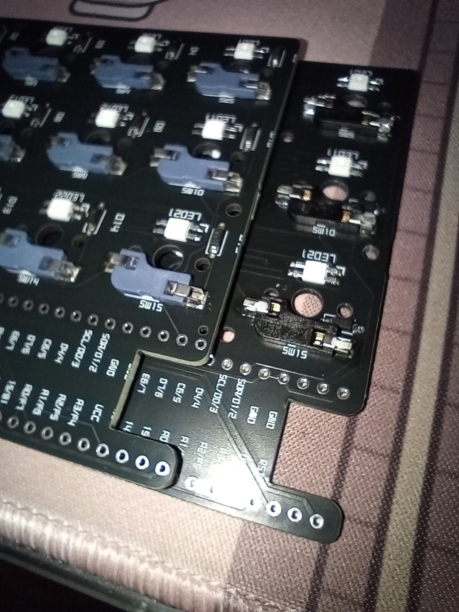
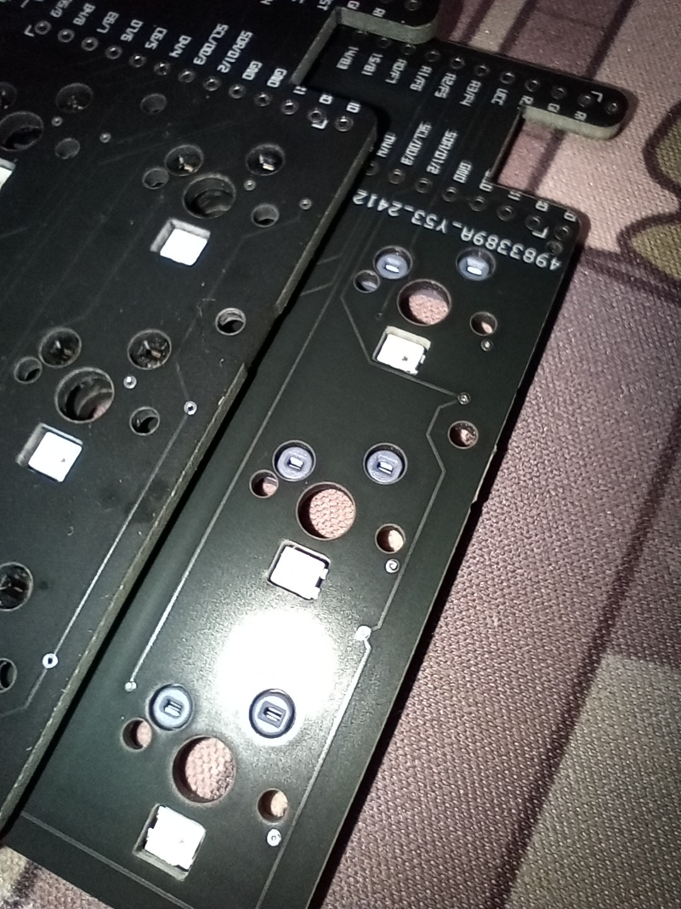
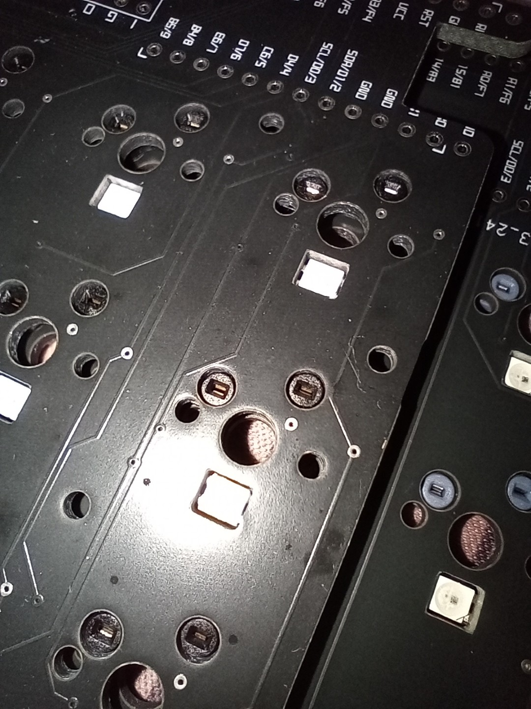

`JLCPCB` では長らく `Kailh`製のソケットが欠品していてPCBAできませんでした。  
今回の注文時にもなく、ダメ元で検索したところ `Hanelectricity` 製の互換品を発見しました。  
正直聞いたことないメーカーですが、互換品でもPCBAしてくれるならありがたいです。

ってことで早速注文して届いたので、検証してみます。

<!-- more -->

## 部品情報

`Kailh` 製ソケットが `CPG151101S11-xx` だったので、前から `CPG151101` を取って検索します。  
ソケットやスイッチなど、MX系の部品が検索されます。

検索結果 → https://jlcpcb.com/parts/componentSearch?searchTxt=CPG151101

下の方に `Hanelectricity` 製のソケットが表示されました。  
MFRパーツ番号は Kailh と同じ `CPG151101S11-16` ですが、JLCPCBのパーツ番号は `C41430893` のようです。

## 仕様を見比べる

`JLCPCB` から仕様をダウンロードして見比べてみました。

- [Kailh製](https://www.lcsc.com/datasheet/lcsc_datasheet_2208291600_Kailh-CPG151101S11-16_C5156480.pdf)
- [Hanelectricity製](https://www.lcsc.com/datasheet/lcsc_datasheet_2410161105_HanElectricity-CPG151101S11-16_C41430893.pdf)

図面を素人なりに読み解いてみると、各種寸法は一致しているので問題なさそう？でした。  

### 価格

部品の価格が安い！

|メーカー|単価|300個割引|PCBA|
|:---|---:|---:|:---:|
|HanElectricity|5.93円|4.27円|エコノミック/標準|
|Kailh|19.77円|在庫なし|標準|

禊は34キーなので、10枚発注で340個なら単価4.27円で注文できます。  
またPCBAで`エコノミック`が適用されるのも地味に嬉しいところですね。

## 注文

ネットで使用例を検索してみたところ、何もヒットしなかったので「これはいいネタになるぞ」ってことでさっそく注文しました。  

`Hanelectricity` 製の部品は `CPG151101S11-16` / `C41430893` です。  
データ入稿時に`Hanelectricity製`を選択してPCBAまで発注しました。

## 届いた

12/26に発注して、1/7に到着しました！  
年末年始を挟んでますが、中国における正月といえば旧正月らしいので通常営業だったっぽいですね。

以下、届いた実物の写真です(ピンぼけ多くてすみません)。

  

  

  

  

  

  

## 組み上げてみた

ソケットがPCBAされているので、有線利用のProMicroならはんだ付けは不要。  
回路も前回と同様なのでコントローラの差し替えだけで動作しました。

### 差し込んだ感じどう？

`Kailh Deep Sea(MX)`でスイッチを差し替えたところ、ちょっと甘いかな？と思いました。  
もともと `Deep Sea` は端子が薄いので Kailh 製でも楽に抜き差しできますが、それよりも気持ち緩いかな？くらい。  
スイッチプレートありが前提ですが、普通に打鍵しててぐらつくことはなかったです。

同じ Kailh製の `Speed Silver` ではしっかりと噛んでいる感じがしました。  

### 接触不良はある？

今のところ発生していません。  
すべてのキーで順調に反応しています。

おそらく接触不良があるとしたらハンダが剥がれるとかだと思いますが、PCBAしてもらってるのでその問題もあまり気にしなくて良さそうです。

### 耐久性？

使い倒さないとわからないですが・・・  
複雑な造りをしていないのでそうそう壊れるものでもないと思います。  

## まとめ

スイッチとしっかり接続できる、という点で問題なさそうです。  
ぱっと見のチープ感やスイッチを差したときの感触は打鍵時には気にならないですし。  

厳密には音などに影響しているかもですが、自分には変化は感じられませんでした。

安くてPCBAしてくれるMX互換ソケットが提供されたことはとても嬉しいです！  
やっぱりはんだ付けしなくても良いのは試すハードル下がりますからね～

([BOOTHでの公開](https://mobneko-shop.booth.pm/items/6029944?_gl=1*1e2kz1q*_ga*MTY0NTEzMzk4Ny4xNzAxMDY1OTE1*_ga_RWT2QKJLDC*MTczNjMxNDk2MC4xMjEuMS4xNzM2MzE0OTY0LjU2LjAuMA..)は1月中旬を予定しています！)