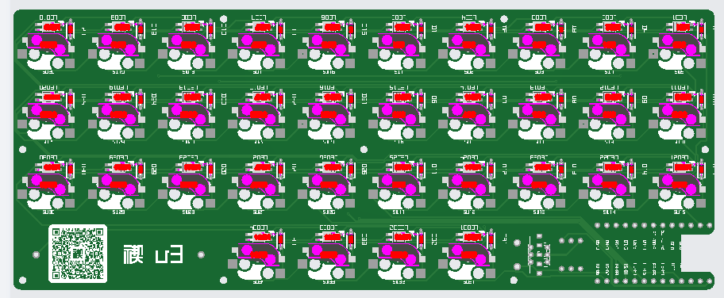
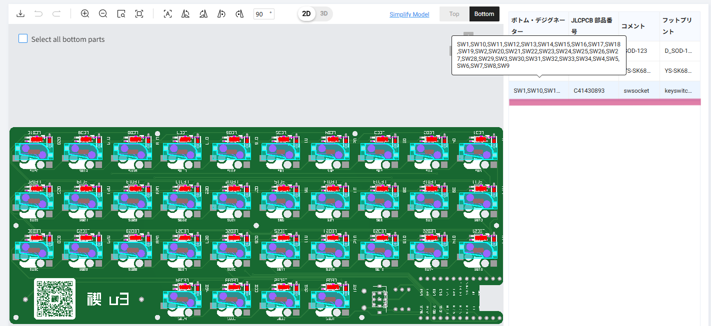
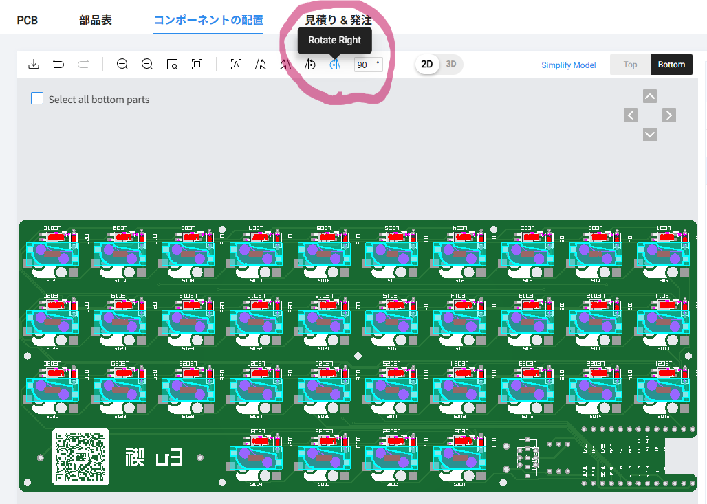
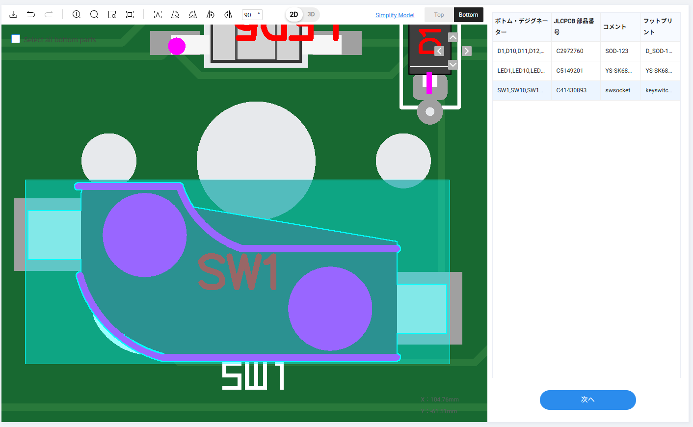

[速報・MX ソケットのジェネリック品？をPCBAしたので検証](../07/index.md)でPCBAする際、発注時にソケットの位置が盛大にずれる問題がありました。

こちら、気合で解決できるのでご紹介します。

<!-- more -->

## まずはファイルをアップロード

いつも通り、ガーバーファイルやBOM、positionファイルなどをアップロードします。  

## 上下が反転している

するとプレビュー段階でソケットが上下反対向きとなっているのが判ります。  
このままでは発注しても直ぐに修正を求められそうです。  
もしかしたらよしなに修正して「これでいいか？」と聞いてくれるかもですが、一往復増えちゃいますね。

  

## 手動で位置を調整する

とはいえ、全部同じ向きにひっくり返せれば問題なさそうです。  
下記の手順で修正し、レビューも通せたのでご参考まで。

### ソケットのみ全選択する

画面右の部品表から、ソケットをクリックします。  
すると全ソケットが選択状態になります。

  

### その場でひっくり返す

ソケットを選択できたら、全てひっくり返します。  
`Rotate Right` を2回クリックすれば180度ひっくり返ります。

  

### 微調整

ひっくり返ったら、全選択のままズームインします。  
穴は隠れて見えないので、端子とランドがうまいこと重なるところへドラッグ移動してください。  
気合でなんとかなります。

  

## 発注！

ということできれいに並んだ(様に見えた)ら発注できます！  
このやり方で無事レビューも通り、PCBAされたものが納品されました。

スイッチごとに角度をつけているタイプだともうちょっと難しいかもですが(未検証)、同じようなやり方でできると思います。

ただ、positionファイルを修正するのがあるべき姿だと思います。  
禊シリーズの場合は単純な配列なのでこの方法で対処しました。

ご参考まで！