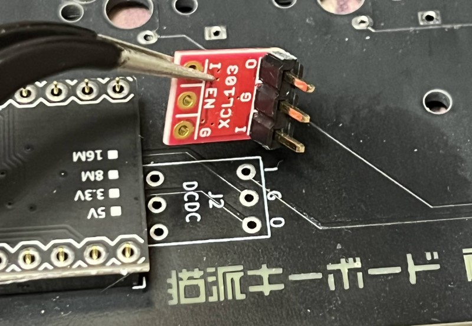
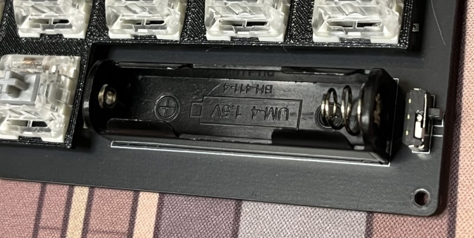

はんだ付けが必要なキットです。  
自作キーボード入門向け。

## パーツリスト

- 付属
  - 基盤
  - MX ソケット x34 個
  - ダイオード x34 個
  - スイッチレイヤー
  - ボトムケース
  - トップケース
  - M3x8mm 5 本
  - ゴム足 3 個
  - かんざし(キースイッチの取り付け補助に使います)
- 別売り(ご自分で用意してください)
  - MX 互換キースイッチ 34 個
  - MX 互換キーキャップ 1u 34 個
  - コントローラ
    - `Pro Micro` or `BLE Micro Pro`(下記参照)
  - 12pin か 13pin のコンスルー、またはピンヘッダ

### 参考購入先

- Pro Micro
  - [Pro Micro: 遊舎工房](https://shop.yushakobo.jp/products/pro-micro)
  - [中華サイトなどでも安く買えます](https://www.aliexpress.com/item/1005004900131198.html)
- BLE Micro Pro
  - [BLE Micro Pro Type-C 版: 遊舎工房](https://shop.yushakobo.jp/products/ble-micro-pro?variant=37665571340449)
  - [Pro Micro サイズの USB 対応 nRF52 マイコンボード: のぎけす屋](https://booth.pm/ja/items/1177319)
- 電源キット(自分で用意する場合)
  - [XCL103 使用 3.3V 出力昇圧 DCDC コンバーターキット: 秋月電子](https://akizukidenshi.com/catalog/g/g116116/)
  - [電池ボックス 単 4×1 本 ピン: 秋月電子](https://akizukidenshi.com/catalog/g/g102670/)
  - [スライドスイッチ ISH-1260-HA-G: 秋月電子](https://akizukidenshi.com/catalog/g/g115370/)

## ダイオード、キーソケットの取り付け

ダイオード、キーソケットは背面に取り付けます。  
ソケット用の白いシルクプリントのある方に配置してください。
電池ボックスのプリントがない方です。

- 極性に注意して、ダイオードを取り付けてください
- 白いシルクプリントに合わせてソケットを取り付けてください

## BLE Micro Pro(BMP) コントローラの取り付け

※ `Pro Micro` を使う場合は[無線化しない場合(ProMicro)](#無線化しない場合promicro)までスキップしてください

### 昇圧コンバータの取り付け

基盤の `I`, `G`, `O` とコンバータの `I`, `G`, `O` を合わせるようにはんだ付けしてください。

このように、基盤の電子部品が上になります。

反対側の端子は未使用で、どこにもつながっていません。  
必須ではないですが、ぐらつかないようにもはんだ付けしても大丈夫です(ショートはさせないでください)。

### 電池ボックス、電源スイッチの取り付け

電池は、左側が `+` になるように設置してください。  
(パナソニックの電池を使うときに、ロゴが正対するようにこの向きになってます！)

### コントローラの取り付け

`BMP` ははんだ付け、コンスルーのどちらでも大丈夫です。  
背面が上になるように(電子部品が基板側になって隠れるように)してください。  
コンスルーが楽で、`BMP`をリサイクルしやすいのでおすすめ。

### ファームウェアの準備

無線化には `BLE Micro Pro` を使います。

1. [ブートローダーをアップデートする](https://sekigon-gonnoc.github.io/BLE-Micro-Pro-WebConfigurator/#/update/bootloader)
   1. バージョン `ble_micro_pro_bootloader_1_2_0` を選び、BMP を USB 接続して `Update` をクリック
   2. 接続、書き込みが終わったら次に進むようメッセージが表示されます
   3. 1 回目は接続だけで終わってしまうことがあるので、表示メッセージを確認してください
2. [アプリケーションをアップデートする](https://sekigon-gonnoc.github.io/BLE-Micro-Pro-WebConfigurator/#/update/application)
   1. バージョン `ble_micro_pro_vial_1_2_0` を選び、BMP を USB 接続して `Update` をクリック
   2. 接続、書き込みが終わったら次に進むようメッセージが表示されます
   3. 1 回目は接続だけで終わってしまうことがあるので、表示メッセージを確認してください
3. [BMP 版ファームウェアをダウンロード](/firmwares/禊v2/bmp-misogi-v2.zip)して解凍
4. コントローラを USB 接続すると、ドライブとして認識されます
   1. 解凍したファイルを上書きコピーしてください
5. コピーが終わったら[Vial Web](https://vial.rocks/)からキーマップをリアルタイムに編集できます！
   1. 繋がらない場合はいったんケーブルを抜いて再接続してみてください(初回はちょっと不安定)

次は[ボトムケース、スイッチレイヤの取り付け](#ボトムケース、スイッチレイヤの取り付け)に進んでください。

## 無線化しない場合(ProMicro)

通常の `Pro Micro` を使います。  
コンスルーまたはピンヘッダは USB 端子の上面が基盤から 4mm 以内となるような高さにしてください。

- `Pro Micro` の場合、基盤の一番外側にあるピンは使いません(外側のピンを 1 つあける)
- [Pro Micro 版ファームウェアをダウンロード](/firmwares/禊v2/promicro-misogi-v2.zip)
- [QMK toolbox](https://github.com/qmk/qmk_toolbox/releases)などを使ってファームウェアを書き込んでください
- ファームウェア書き込みが終わったら[Vial Web](https://vial.rocks/)からキーマップをリアルタイムに編集できます！
  - 繋がらない場合はいったんケーブルを抜いて再接続してみてください

## ボトムケース、スイッチレイヤの取り付け

付属の「かんざし」を使い、スイッチレイヤとキースイッチを取り付けていきます。

- ボトムケースと基盤、スイッチレイヤをネジで留めてください
  - 中央の 1 箇所のみ
- 基盤とスイッチレイヤの間にかんざしを差し込み、かんざしがスイッチレイヤを支えているところにスイッチを差し込んでいきます
- スイッチレイヤはたわみやすいので、かんざしを基盤とスイッチレイヤ間に挟みながらスイッチを挿していきます

## トップケースの取り付け

- 外周部のネジを締めていきます
- プラスチックなので強い力には耐えられません
- ネジの頭が底面とフラットになるくらいにしてください
  - きついなと思ったら途中で一回ゆるめてから再度締めるとスムーズです

## ゴム足の貼付け

3D プリンタケースは微妙に反りやすく、底面がまっすぐになっていないです。  
厚いデスクマットの上ならそのまま使えますが、硬い机の上で使うならゴム足があったほうが良いです。

- キーボードの奥側、コーナーに 2 点
- キーボードの手前側、中央に 1 点

の 3 点に貼り付けることで安定します(キット内付属のゴム足も 3 点のみ同梱です)。  
4 点以上つけてしまうと反りのせいで逆に安定しません。

以上で完成となります、お疲れ様でした！

## 付録

- [3D プリント用 STL ファイル](/firmwares/禊v1/stl-misogi-v1.zip)
