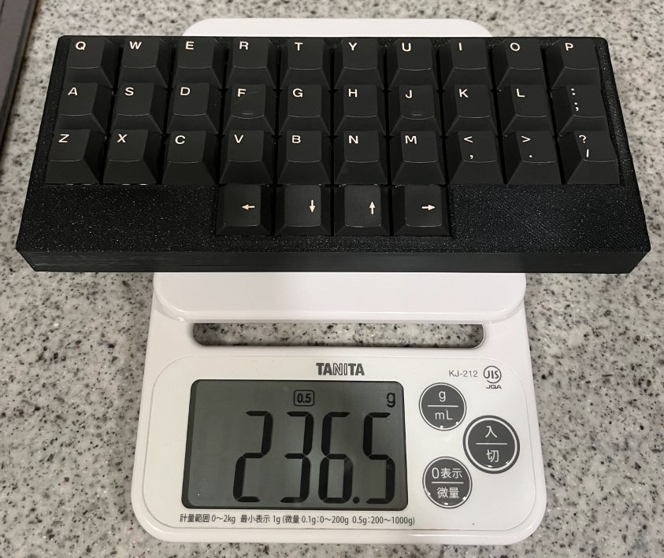

背面電池バージョン。  
配布バージョンでは電源キットインストール済みのため、とても組み立てやすくなっています。

  
電池込みで 236.5g と軽量です。

## パーツリスト

- 付属
  - 基盤
  - スイッチレイヤー
  - ボトムケース
  - トップケース
  - M3x8mm 11 本
  - ゴム足 3 個
  - かんざし(キースイッチの取り付け補助に使います)
- 別売り(ご自分で用意してください)
  - MX 互換キースイッチ 34 個
  - MX 互換キーキャップ 1u 34 個
  - コントローラ
    - `Pro Micro` or `BLE Micro Pro`(下記参照)
  - 12pin か 13pin のコンスルー、またはピンヘッダ

### 参考購入先

- Pro Micro
  - [Pro Micro: 遊舎工房](https://shop.yushakobo.jp/products/pro-micro)
  - [中華サイトなどでも安く買えます](https://www.aliexpress.com/item/1005004900131198.html)
- BLE Micro Pro
  - [BLE Micro Pro Type-C 版: 遊舎工房](https://shop.yushakobo.jp/products/ble-micro-pro?variant=37665571340449)
  - [Pro Micro サイズの USB 対応 nRF52 マイコンボード: のぎけす屋](https://booth.pm/ja/items/1177319)
- 電源キット(キットに付属していますので、スペアが必要なら)
  - [XCL103 使用 3.3V 出力昇圧 DCDC コンバーターキット: 秋月電子](https://akizukidenshi.com/catalog/g/g116116/)
  - [電池ボックス 単 4×1 本用 リード線・底面引出し: 秋月電子](https://akizukidenshi.com/catalog/g/g103046/)
  - [スライドスイッチ ISH-1260-HA-G: 秋月電子](https://akizukidenshi.com/catalog/g/g115370/)

## コントローラの取り付け

コントローラを組み付け、ファームウェアを書き込みます。  
`Vial` 対応しています。

配布バージョンのキーマップは私が普段から愛用しているものですが、ちょっとクセがあるかもしれませんｗ  
ご自身で最適なキーマップを探求してください！

### 無線化しない場合(ProMicro)

通常の `Pro Micro` を使います。  
コンスルーまたはピンヘッダは USB 端子の上面が基盤から 4mm 以内となるような高さにしてください。

- `Pro Micro` の場合、基盤の一番外側にあるピンは使いません(向かって左側を 1 つあける)
- [Pro Micro 版ファームウェアをダウンロード](/firmwares/禊v2/promicro-misogi-v2.zip)
- [QMK toolbox](https://github.com/qmk/qmk_toolbox/releases)などを使ってファームウェアを書き込んでください

### 無線化する場合(BLE Micro Pro)

無線化には `BLE Micro Pro` を使います。  
コンスルーまたはピンヘッダは高さ `2.5mm` のタイプを選んでください。

1. [ブートローダーをアップデートする](https://sekigon-gonnoc.github.io/BLE-Micro-Pro-WebConfigurator/#/update/bootloader)
   1. バージョン `ble_micro_pro_bootloader_1_2_0` を選び、BMP を USB 接続して `Update` をクリック
   2. 接続、書き込みが終わったら次に進むようメッセージが表示されます
   3. 1 回目は接続だけで終わってしまうことがあるので、表示メッセージを確認してください
2. [アプリケーションをアップデートする](https://sekigon-gonnoc.github.io/BLE-Micro-Pro-WebConfigurator/#/update/application)
   1. バージョン `ble_micro_pro_vial_1_2_0` を選び、BMP を USB 接続して `Update` をクリック
   2. 接続、書き込みが終わったら次に進むようメッセージが表示されます
   3. 1 回目は接続だけで終わってしまうことがあるので、表示メッセージを確認してください
3. [BMP 版ファームウェアをダウンロード](/firmwares/禊v2/bmp-misogi-v2.zip)して解凍
4. コントローラを USB 接続すると、ドライブとして認識されます
   1. 解凍したファイルを上書きコピーしてください
5. コピーが終わったら[Vial Web](https://vial.rocks/)からキーマップをリアルタイムに編集できます！
   1. 繋がらない場合はいったんケーブルを抜いて再接続してみてください(初回はちょっと不安定)

## ボトムケース、スイッチレイヤの取り付け

付属の「かんざし」を使い、スイッチレイヤとキースイッチを取り付けていきます。

- ボトムケースと基盤、スイッチレイヤをネジで留めます
  - スイッチレイヤのみ、3 箇所
- スイッチレイヤはたわみやすいので、かんざしを基盤とスイッチレイヤ間に挟みながらスイッチを挿していきます

## トップケースの取り付け

- 外周部のネジを締めていきます
- プラスチックなので強い力には耐えられません
- 最大でもネジの頭が底面とフラットになるくらいにしてください

## ゴム足の貼付け

3D プリンタケースは微妙に反りやすく、底面がまっすぐになっていないです。  
厚いデスクマットの上ならそのまま使えますが、硬い机の上で使うならゴム足があったほうが良いです。

- キーボードの奥側、コーナーに 2 点
- キーボードの手前側、中央に 1 点

の 3 点に貼り付けることで安定します(キット内付属のゴム足も 3 点のみ同梱です)。  
4 点以上つけてしまうと反りのせいで逆に安定しません。

以上で完成となります、お疲れ様でした！

## 付録

- [3D プリント用 STL ファイル](/firmwares/禊v2/stl-misogi-v2.zip)

## 履歴

- 2024-07-10 販売開始
