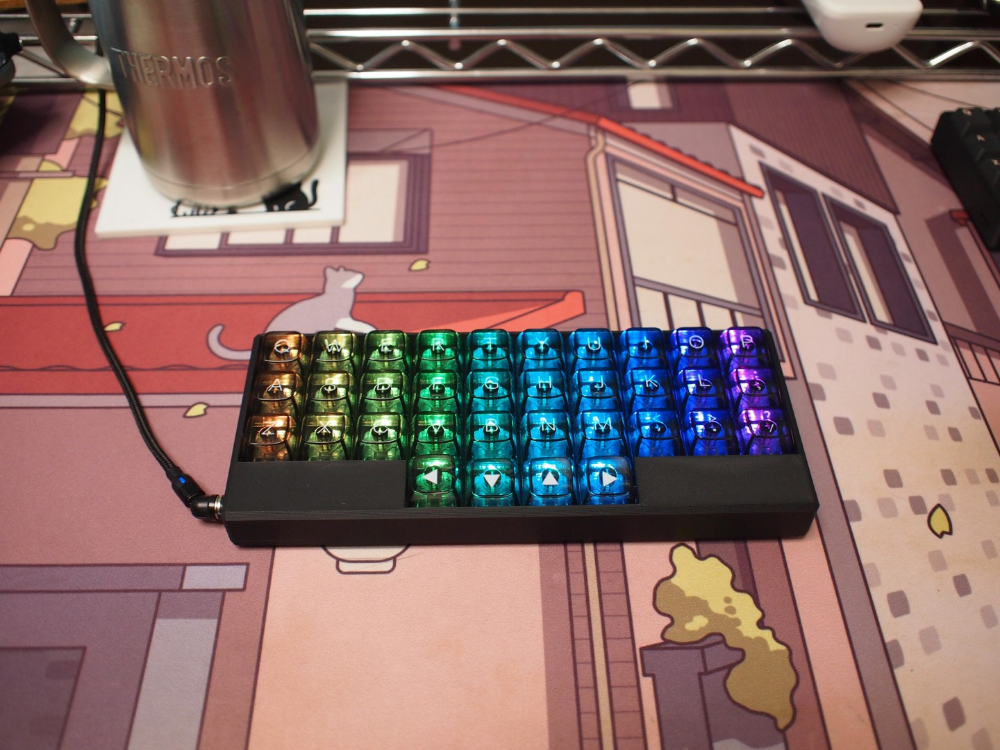
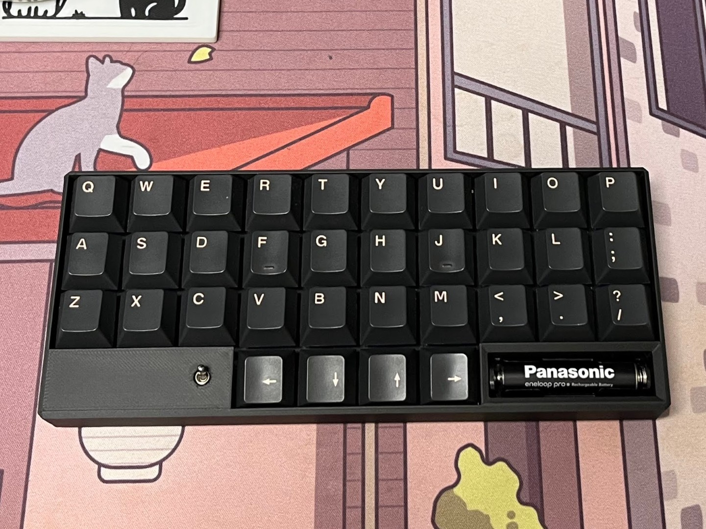
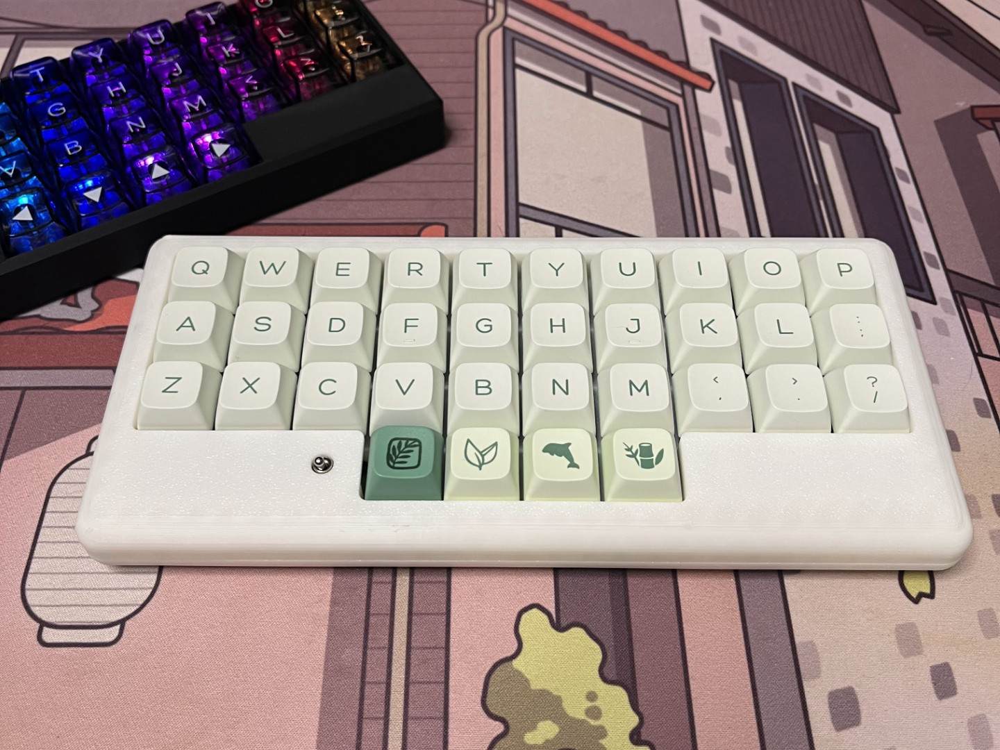
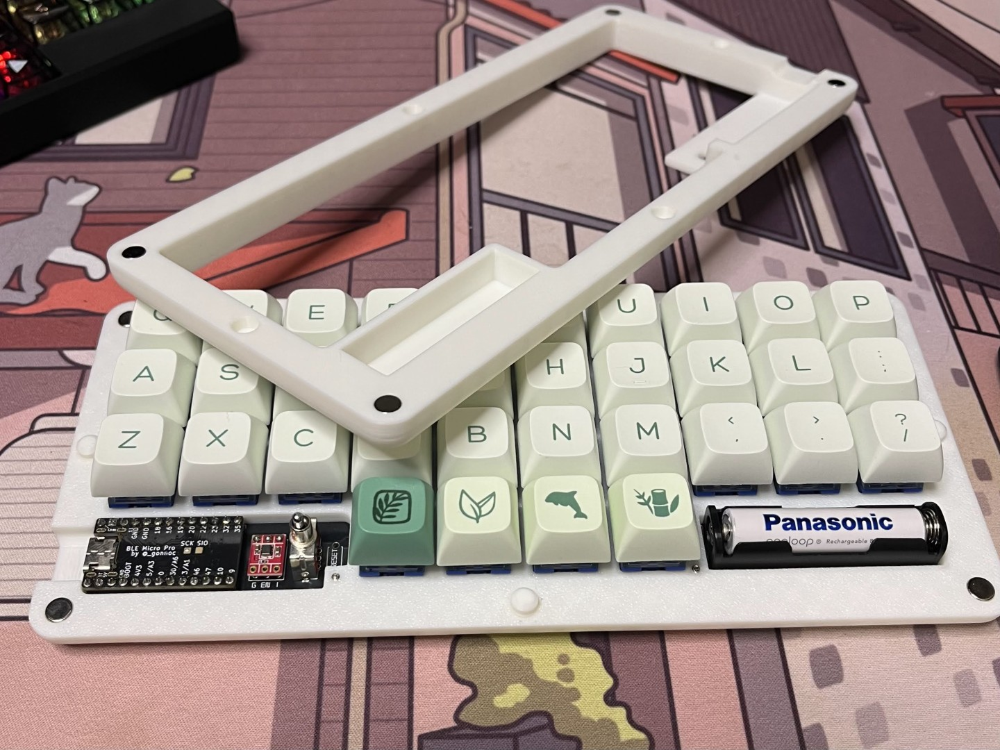

## v3.2.1 の変更点

基板仕様は `v3.2` と同じです。  
`v3.2` からの変更はケースの構造のみですが、ビルド手順が少し異なります。

## v3.2.1 の特徴

- `ProMicro`、`BLE Micro Pro` に対応
- `Vial` 対応
- ダイオード、ソケットはハンダ付け済み
- ケースの構造を見直し、より強固に、外注しやすく

## 組み立て手順

すみません、作成中・・・  
とりあえず完成イメージだけ載せておきます。  
ケース以外は `v3.2` と変わらないので読み替えることで組み立てることはできます。

## 完成イメージ

### Pro Micro 用

面取りを加えたスリムなケース。

### BMP 用、角形

電池開放型のスリムケース。  
実はこのタイプがわずかにですが一番ベゼルが狭く、コンパクトです。

### BMP 用、丸型マグネット

面取りではなく、丸く角を落とすことで「ちょっとカワイイ」をねらってみました。

電池はマグネットケースを開いてアクセスできます。

