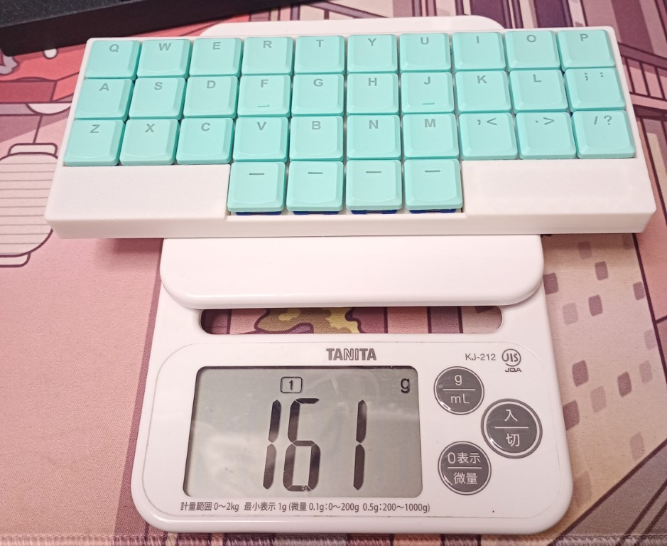
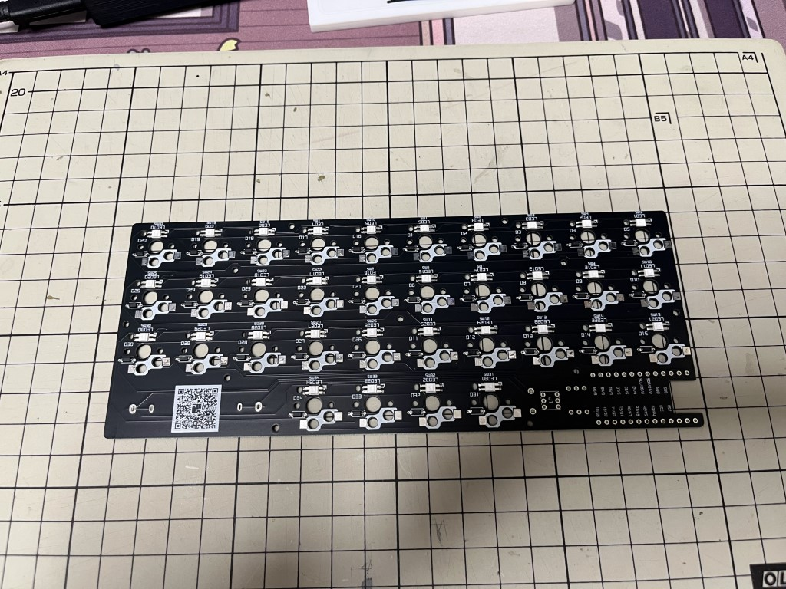
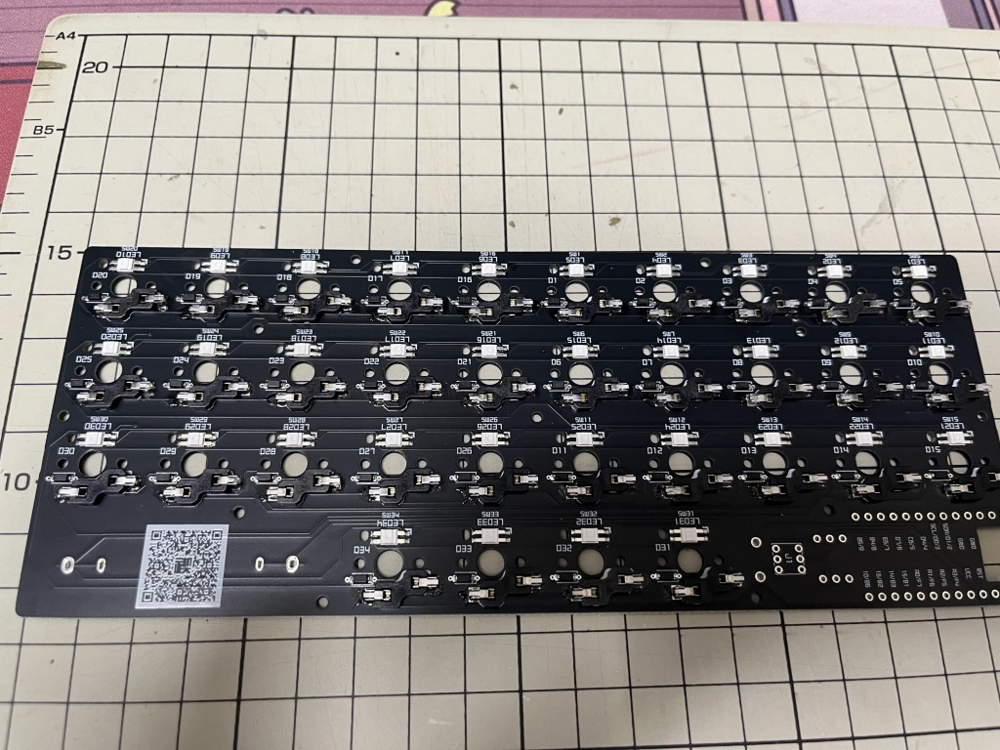
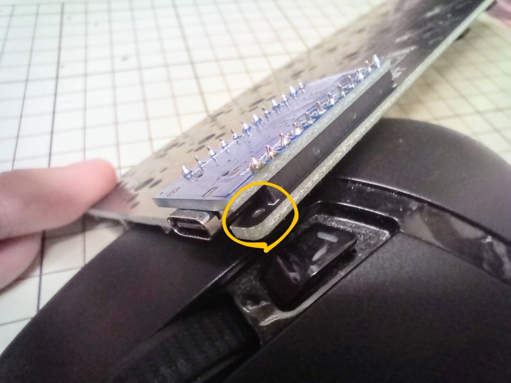
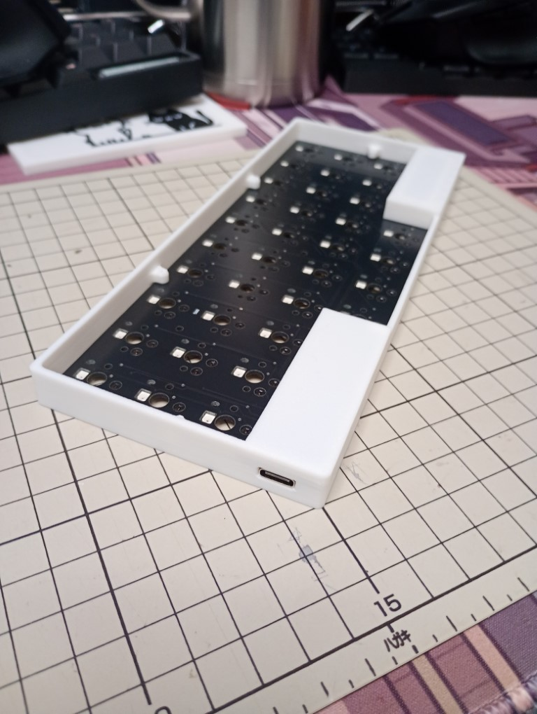
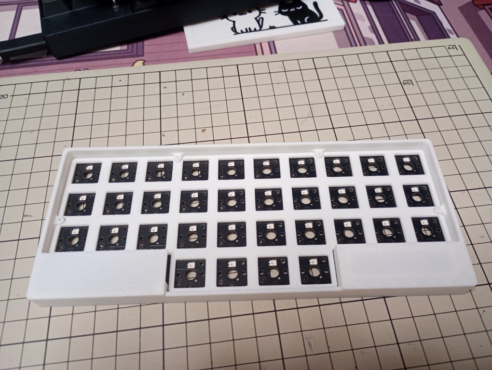
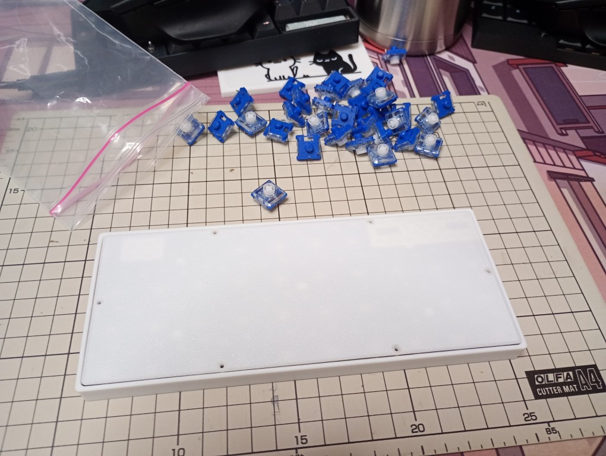
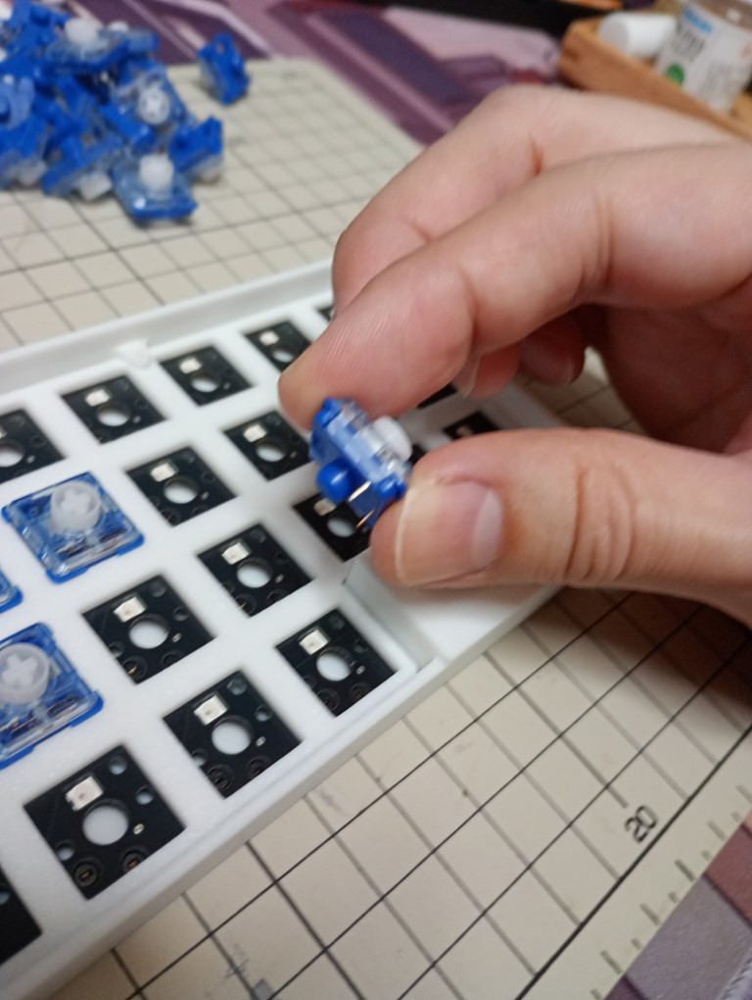
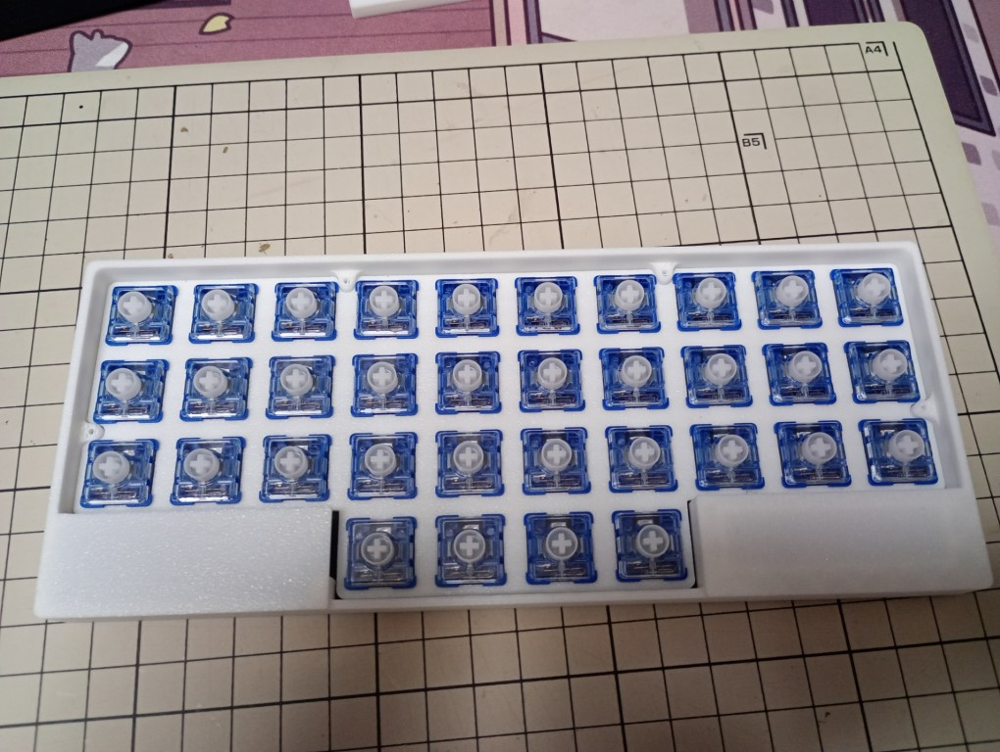
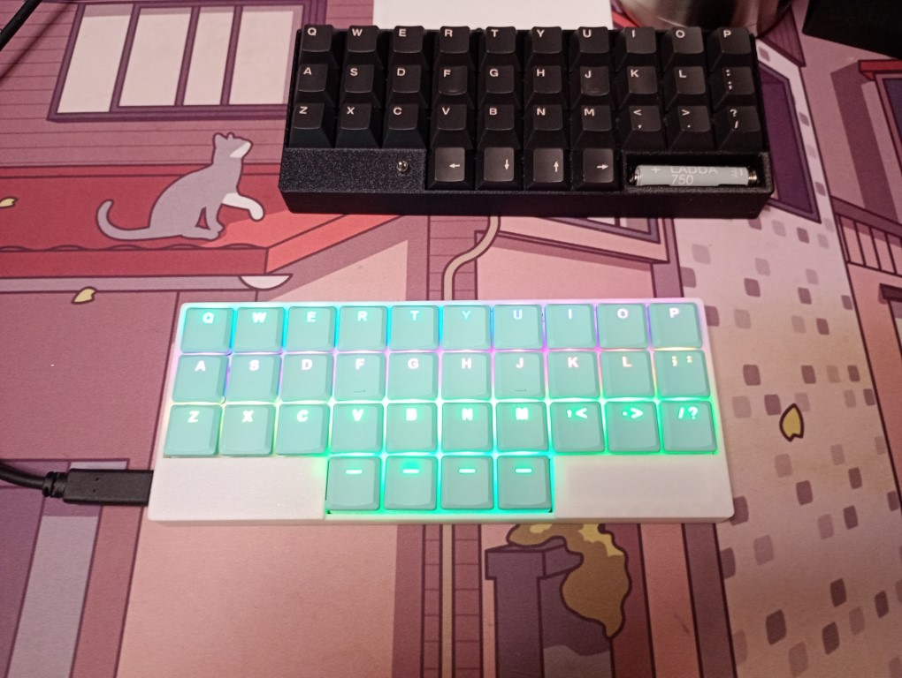

※ このページは書きかけです、販売時の情報と異なる場合があります

## シン禊 の特徴

禊をベースに、LowProfile 対応で薄型(thin)化した「シン禊」です。  
せっかくの薄型・軽量キーボードですが、諸事情により ProMicro 版のみで販売開始です。

<!-- 禊シリーズの特徴でもある単４をあきらめ、AAAA 電池搭載でより高さを抑える設計にしました。 -->

## パーツリスト

### キットに付属するもの

- 基盤
- スイッチプレート
- ボトムプレート
- トップケース
- ネジ M2x8mm 6 本
- ゴム足 3 個
<!-- - 電源部品(ProMicro 版には付属しません)
  - 昇圧コンバータ
  - トグル式電源スイッチ
  - AAAA 電池クリップ -->

### 別売り(ご自分で用意してください)

- choc v2 互換スイッチソケット 34 個
- 上記ソケットと互換性のあるキースイッチ 34 個
- 上記キースイッチと互換性のあるキーキャップ 1u 34 個
- マイコンボード
  - ProMicro(USB Type-C 対応版)
  <!-- - `Pro Micro` or `BLE Micro Pro`(下記参照) -->
- 12 ピンのコンスルー、またはピンヘッダ、高さは 2.5mm
<!-- - 12pin か BMP の場合 13pin のコンスルー、またはピンヘッダ、高さは 2.5mm -->

## パーツの参考購入先

<!-- - BLE Micro Pro(どちらで購入しても OK)
  - [BLE Micro Pro Type-C 版: 遊舎工房](https://shop.yushakobo.jp/products/ble-micro-pro?variant=37665571340449)
  - [Pro Micro サイズの USB 対応 nRF52 マイコンボード: のぎけす屋](https://booth.pm/ja/items/1177319) -->

国内では「[遊舎工房](https://shop.yushakobo.jp/)」、「[TALP KEYBOARD](https://talpkeyboard.net/)」が有名です。  
`Pro Micro` やスイッチソケットは `AliExpress` などでも購入できます。

### 遊舎工房で揃える

- [Pro Micro Type-C 版](https://shop.yushakobo.jp/products/3905)
- [コンスルー](https://shop.yushakobo.jp/products/31?variant=37665714405537)
  - 12 ピンで 2.5mm 高が適合します
  - 2 つ必要です
  - 2.5mm 高ならピンヘッダでも大丈夫です
- [Kailh Switch Socket](https://shop.yushakobo.jp/products/a01ps?_pos=1&_sid=782ff49e7&_ss=r)
  - Kailh Choc ロープロファイル互換 PCB ソケット x34 個
  - `Kailh Choc ロープロファイル用`を選択してください

### TALP KEYBOARD で揃える

- [Pro Micro ATmega32U4-MU 5V/16MHz/USB-C(互換品/青)](https://talpkeyboard.net/items/62e24e6f8a0bd07fe2d38137)
- [MAC8 コンスルー XB-3-2.5-12P \(高さ 2.5mm/12 ピン/1 個\)](https://talpkeyboard.net/items/5e056626d790db16e2889233)
  - 2 つ必要です
  - 2.5mm 高ならピンヘッダでも大丈夫です
- [Choc スイッチ用 Kailh PCB ソケット](https://talpkeyboard.net/items/6365b6224ff8c216413a0c92)
  - Kailh Choc ロープロファイル互換 PCB ソケット x34 個

<!-- ### BMP 版キットに含まれるもの

キットに付属していますので通常は不要です。スペアが必要なら。

- [XCL103 使用 3.3V 出力昇圧 DCDC コンバーターキット: 秋月電子](https://akizukidenshi.com/catalog/g/g116116/)
- [電池ボックス 単 4×1 本 ピン: 秋月電子](https://akizukidenshi.com/catalog/g/g102670/)
- [基板用小型 3P トグルスイッチ 1 回路 2 接点: 秋月電子](https://akizukidenshi.com/catalog/g/g112407/) -->
<!-- - [3.3V 出力昇圧 DCDC コンバーター: 秋月電子](https://akizukidenshi.com/catalog/g/g113066/) -->

## マイコンの用意

<!--
### マイコンの用意(BMP 版)

BMP を組み付け、ファームウェアを書き込みます。
`Vial` に対応しています。

1. [ブートローダーをアップデートする](https://sekigon-gonnoc.github.io/BLE-Micro-Pro-WebConfigurator/#/update/bootloader)
   1. バージョン `ble_micro_pro_bootloader_1_2_2` を選び、BMP を USB 接続して `Update` をクリック
   2. 接続、書き込みが終わったら次に進むようメッセージが表示されます
   3. 1 回目は接続だけで終わってしまうことがあるので、表示メッセージを確認してください
2. [アプリケーションをアップデートする](https://sekigon-gonnoc.github.io/BLE-Micro-Pro-WebConfigurator/#/update/application)
   1. バージョン `ble_micro_pro_vial_1_2_3` を選び、BMP を USB 接続して `Update` をクリック
   2. 接続、書き込みが終わったら次に進むようメッセージが表示されます
   3. 1 回目は接続だけで終わってしまうことがあるので、表示メッセージを確認してください
3. [BMP 版ファームウェアをダウンロード](/firmwares/禊v3/bmp-misogi-v3.zip)して解凍
4. マイコンボードを USB 接続すると、ドライブとして認識されます
   1. 解凍したファイルを上書きコピーしてください
5. コピーが終わったら[Vial Web](https://vial.rocks/)からキーマップをリアルタイムに編集できます！
   1. 繋がらない場合はいったんケーブルを抜いて再接続してみてください(初回はちょっと不安定) -->

### マイコンの用意(ProMicro 版)

先にファームウェアを書き込みます。  
`Vial` に対応しています。

- [Pro Micro 版ファームウェア](/firmwares/禊v3/promicro-misogi-v3.zip)をダウンロード
- [QMK toolbox](https://github.com/qmk/qmk_toolbox/releases)などを使ってファームウェアを書き込んでください
- ファームウェア書き込みが終わったら[Vial Web](https://vial.rocksob/)からキーマップをリアルタイムに編集できます！
  - 繋がらない場合はいったんケーブルを抜いて再接続してみてください

**※ Pro Micro のバリエーション**  
`Pro Micro` の種類によっては、USB Type-C to Type-C での接続ができません。  
遊舎工房で扱っている[Pro Micro Type-C 版](https://shop.yushakobo.jp/products/3905)では動作確認できています。  
BMP 互換サイズで販売されているものもありますが、多くが旧型で、PC 側が Type-A しか対応していない場合もあります。  
お手持ちのコントローラボードが Type-C 接続に対応しているかの質問には答えられませんのでご了承ください。

### キーマップについて

配布バージョンのキーマップは私が普段から愛用しているものですが、ちょっとクセがあるかもしれません。  
ご自身で最適なキーマップを探求してください！

→ [クセありなキーマップの紹介はこちら](/blog/2024/07/13/keymaps)

## 組み立て

### ソケットの取り付け

choc 互換のソケット(34 個)を用意し、基盤の裏面にハンダ付けしてください。  
ソケットの形に白いマスクがしてあります。  

34 個のソケットすべてをハンダ付けしてください。  

<!-- ### 電源部品の組付け

BMP を使う場合は電池ボックス、電源スイッチ、昇圧コンバータを組み付けます。

### 昇圧コンバータの取り付け

基盤の `I`, `G`, `O` とコンバータの `I`, `G`, `O` を合わせるようにハンダ付けしてください。

反対側の端子 3 つは未使用で、どこにもつながっていません。
必須ではないですが、ぐらつかないようにもハンダ付けしても大丈夫です(ショートはさせないでください)。

### 電池クリップの取り付け

クリップをハンダ付けします。
クリップはニッケルなのでくっつきにくいです。フラックスがあるといくらか楽です。

電池は、左側が `+` になるように設置してください。

### 電源スイッチの取り付け

電源スイッチは、取付向きに注意してください。
押し込んだときに ON にしたい場合は写真のような向きで配置します。 -->

### マイコンボードの取り付け

コンスルーピンをマイコンに組み付けます。  
コンスルーのサイドにある小窓をマイコン側にしてください。

<!--  -->

**マイコンボードは背面(電子パーツが少ない方)が上になります(写真参照)。**  
コンスルーまたはピンヘッダは高さ `2.5mm` のタイプを選んでください。  
また、ProMicro バージョンでは電源ピンを使わないため基盤の外側１つは空けておいてください。

コンスルーはハンダ付けしなくても動作しますが、抜き差しするときにピンが曲がりやすいのでマイコン側はハンダ付けをおすすめします。

### トップケースの取り付け

トップケースを被せます。  
向かって左、マイコン側から USB 端子の出口を合わせながら被せていきます。

### スイッチプレートの取り付け

取り付けと言っても載せるだけです。  
正確な位置決めはスイッチを差し込んで行います。

### ボトムプレートの取り付け

裏返してボトムプレートを載せます。  
マイコンと電池ボックスに合うように置いてください。  
基盤に余計な力が加わらないようにするためなので、この時点ではまだネジ締めは不要です。

### スイッチの取り付け

スイッチプレートを載せ、スイッチを取り付けていきます。

### スイッチの動作確認

次のボトムプレートを取り付ける前にスイッチの動作確認をしてください。  
`vial` の `Matrix tester` を使い、すべてのスイッチで反応があることを確認します。

- スイッチが反応しない場合
  - スイッチを一度抜いてみてください、ピンが折れていませんか？
  - ハンダがしっかり接合されて場合があるので、ソケットに追いハンダしてください

### ボトムプレートの取り付け

スイッチがすべて反応することを確認できたらボトムプレートを付属のネジで締めてください。

### キーキャップの取り付け

お好きなキーキャップを取り付けてください。  
スイッチの上側が LED 用の穴になっているので、透過印が上になっているキーキャップがよく光ります。  
写真の様に THT シリーズがいい感じです！

### ゴム足の貼付け

3D プリンタケースは微妙に反りやすく、底面がまっすぐになっていないです。  
厚いデスクマットの上ならそのまま使えますが、硬い机の上で使うならゴム足があったほうが良いです。

- キーボードの奥側、コーナーのソケット下に 2 点
- キーボードの手前側、中央に 1 点

の 3 点に貼り付けることで安定します(キット内付属のゴム足も 3 点のみ同梱です)。  
4 点以上つけてしまうと反りのせいで逆に安定しません。

## 完成

以上で完成となります、お疲れ様でした！  
[#misogi34](https://x.com/search?q=%23misogi34) のハッシュタグをつけて投稿してもらえると励みになります！

<!-- ## 付録

- [3D プリント用 STL ファイル](/firmwares/禊v3/stl-thin-misogi-v3.zip) -->

<!-- ## 履歴

- 2024-11-01 販売開始 -->
